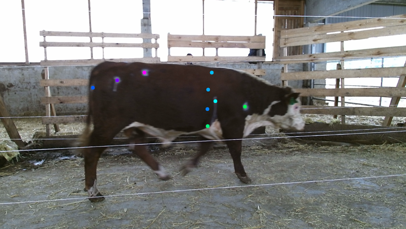
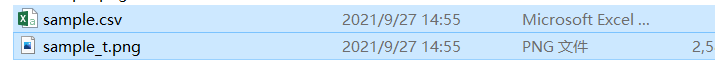
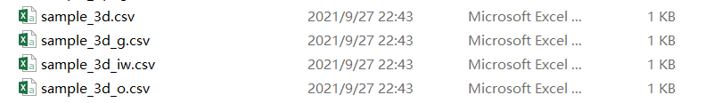

## Automatic livestock body measurement based on keypoint detection with multiple depth cameras

Created by <a href="https://github.com/DuAooo" target="_blank">Ao Du</a>, <a href="http://clst.cau.edu.cn/art/2018/8/8/art_31197_580629.html" target="_blank">Hao Guo</a> from China Agricultural University.


### Introduction
A flexible body measurement method that combines the advantages of 2D and 3D data is proposed. Different from previous measurement methods which use peak values to detect body parts on point clouds, we perform body measurement based on the landmarks of each body measurement. We find the landmarks using the keypoints detector. Utilizing the depth camera, we project the 2D landmarks into 3D space. All the body measurements were calculated using these 3D landmarks on the body surface of livestock. Benefiting from the advances in 2D keypoint detectors, landmarks on livestock point clouds can be quickly detected with less training data. Compared to the previous body measurement methods, our method is more general for different species and body parts of livestock.


### Prerequisites
Only suport win_x64 platform so far.
* For body measurement, please install:
<a href="https://github.com/PointCloudLibrary/pcl/releases/download/pcl-1.11.1/PCL-1.11.1-AllInOne-msvc2019-win64.exe"> pcl 1.11.1 </a> 

* For mapping 2D points to 3D sapce, please install:
<a href="https://www.microsoft.com/en-us/download/confirmation.aspx?id=44561">Kinect for Windows SDK v2.0 </a>

* For keypoint detection, please install:
<a href="https://github.com/DeepLabCut/DeepLabCut">deeplabcut 2.2b8</a> (pip install deeplabcut==2.2b8)
and its dependence:
Python 3.7 
keras 2.1.5
tensorflow 1.13.1
and so on.

### Usage
#### Directly test body measurement using the sample data:
###### We have saved the keypoint files in the "./Keypoints/left_m","./Keypoints/right_m", and "./Keypoints/top". To predict of these keypoints by yourself, please follow the later instructions.
1. Open "bodymeasurement.py", Change "cur_path" to your path in line 8.
```
cur_path = "F:/BodyMeasurement/manuscript/gitee-code/"
```
2. run (python bodymeasurement.py)

The output body measurements file was stored under "./KeyPoints/top"


#### Predict key points on RGB images:
1. Open ./KeyPoints/body_measurement-Du-2021-04-23/config.yaml
Change project_path to your path.
```
project_path: KeyPoints/body_measurement-Du-2021-04-23
```
2. Open ./KeyPoints/getpose.py, replace "cur_path" with your path in line 8. The outputs of this script are predicted image "*_.t" and joint pose file "*.csv"
```
cur_path = "F:/BodyMeasurement/manuscript/gitee-code/"
```
3. Chose "sides" to be predicted
```
sides = "left_m"  #"left_m", "right_m", "top"
#chose side views
```
4. run get_pose.py(python get_pose.py)

The output 2D pixel pose and image with predicted keypoints are stored under ./Keypoints + "sides"

#### Project 2D keypoints into 3D Space:
##### note! this step need to connect Kinect v2 camera.
1. Open "CameraSpaceCoordinateMapping_Cattle.py", change "cur_path" to your path.
```
cur_path = "F:/BodyMeasurement/manuscript/gitee-code/"
```
2. Choose "sides" to be projected. The "depth_side" should be same with "sides".
```
sides = "top" #left_m,right_m,top
depth_side = "TopClouds" #LeftDepth,RightDepth,TopClouds
```
3. Run CameraSpaceCoordinateMapping_Cattle.py

The "sample_3d.csv" is the projected 3D keypoints. "sample_3d_g.csv", "sample_3d_iw.csv", and "sample_3d_o.csv" are the interpolated keypoints, corresponding to the girth, ilumn length and oblique length.
### Folder structure and notes
##### We will make detailed data available after our paper publication, any question please do not hesitate to contact me <s20193081375@cau.edu.cn>.
```
git_code:
│  body_measurement.py                     //bat file for body measurement
│  CameraSpaceCoordinateMapping_Cattle.py  //bat file for projecting 2D points to 3D space 
│  keypoint_measure.exe    //exe file of body measurement
│  readme.md
│
├─fig
│
├─KeyPoints
│  │  CoordinateMapper.exe  //exe file for projecting 2D points to 3D space 
│  │  getpose_frame.py      //prediction script
│  │
│  ├─body_measurement-Du-2021-04-23  //deeplabcut project, including cattle keypoint detector
│  │  │  config.yaml        //need to change the "project_path"
│  │  │
│  │  └─dlc-models
│  │      └─iteration-0
│  │        ...
|  |
│  ├─left_m
│  │      sample.csv        //2D pixel coordinates of keypoints
│  │      sample.png        //image of side view
│  │      sample_3d.csv     //3D coordinates of keypoints
│  │      sample_3d_g.csv   //3D coordinates of girth keypoints
│  │      sample_3d_iw.csv  //3D coordinates of illumn points
│  │      sample_3d_o.csv   //3D coordinates of oblique length points
│  │      sample_t.png      //predicted by getpose.py
│  │
│  ├─right_m  //right side keypoints, same with files in left_m
│  │
│  └─top      //top side keypoints, same with files in left_m
│
└─PointCloud  //left depth image, as the input of the  projection fuction
    ├─LeftDepth     //left side point cloud
    │      sample.png
    │      sample_.pcd
    │
    ├─matrices_txt  //transfom matrix(transfer left view and right view to the top view)
    │      sample_l.txt    //left to top view
    │      sample_r.txt    //right to top view
    │
    ├─RightDepth
    │      sample.png
    │      sample_.pcd
    │
    └─TopClouds
            sample.png
            sample_.pcd
            sample_3d.txt  //transfom matrix for pose normalization

```

### Reference
* Kinect for Windows SDK v2 Sample Program:
https://github.com/UnaNancyOwen/Kinect2Sample
* Deeplabcut Program:
https://github.com/DeepLabCut/DeepLabCut

#### Others in the future
* Livestock shape analysis 
* Livestock behavior analysis and so on